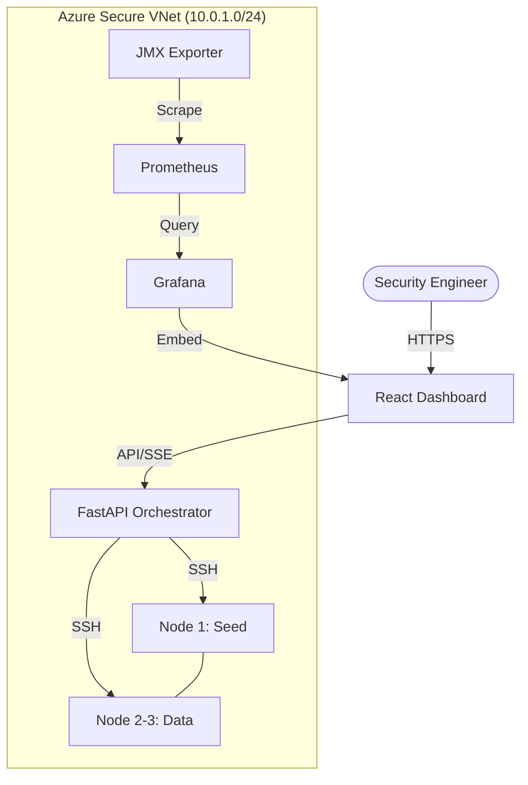

# CIS Apache Cassandra 4.0 — DevSecOps Compliance Platform

> **NT542.Q22 DevSecOps — Group Project**  
> Implementation of CIS Apache Cassandra 4.0 Benchmark v1.3.0 across an automated 3-node Azure infrastructure.

---

## 📋 Executive Summary

This platform provides an automated solution to **audit**, **harden**, and **monitor** a 3-node Apache Cassandra 4.0 cluster according to the **CIS Benchmark v1.3.0** standards. It integrates infrastructure-as-code, real-time security orchestration, and modern observability into a unified DevSecOps workflow.

### System Components

| Layer | Technology | Purpose |
|---|---|---|
| **Cloud Infrastructure** | 3 × Azure Ubuntu 22.04 (ARM64) | Scalable, security-hardened node cluster (`10.0.1.11–13`) |
| **Security Engineering** | Bash (`scripts/`) | Procedural CIS audit and automated remediation |
| **Orchestration API** | FastAPI (Python 3.12) | SSH-based dispatching, SSE reports, and status management |
| **Management Portal** | React 18 + Vite | Centralized compliance dashboard and monitoring control |
| **Observability Stack** | Prometheus + Grafana | Real-time security metrics and JMX performance data |
| **CI/CD Pipeline** | GitHub Actions | Automated security gates (Static Analysis, Linting, Testing) |

---

## 🏗️ System Architecture

The platform operates on a decentralized scanning model where the **Orchestration API** dispatches non-intrusive audit and hardening commands to the cluster nodes over encrypted SSH channels.



---

## 🚀 Deployment & Operations

### 1. Infrastructure Provisioning (Member 1)

The infrastructure is provisioned via **Terraform** or manual Cloud-Init deployment.

```bash
# Verify cluster baseline (OpenJDK 11 + Cassandra 4.0)
sudo apt-get update && sudo apt-get install -y openjdk-11-jdk cassandra
```

### 1.1 Operational Efficiency & Cost Management

To optimize **Azure Student Credit** usage, the system includes an operational power management utility. This allows for deallocating compute resources when idle while maintaining disk integrity.

**Power Management (Windows PowerShell):**
```powershell
# Check current power state of cluster nodes
.\scripts\cluster-power.ps1 status

# Provision/Start all nodes (Warm-up time: 2-3 mins)
.\scripts\cluster-power.ps1 start

# Deallocate all nodes (Stops compute billing)
.\scripts\cluster-power.ps1 stop
```

---

### 2. CIS Security Hardening (Member 2)

The system supports granular or full-cluster security enforcement according to CIS recommendations.

```bash
# Execute full security audit
sudo bash scripts/cis-tool.sh audit all

# Apply automated remediation (Hardening)
sudo bash scripts/cis-tool.sh harden all

# Section-specific auditing
sudo bash scripts/cis-tool.sh audit 2  # Authentication focus
```

---

### 3. Orchestration & Monitoring (Members 3 & 4)

#### Backend Dispatcher
```bash
cd backend
uvicorn main:app --host 0.0.0.0 --port 8000
# Documentation: http://10.0.1.11:8000/docs
```

#### Monitoring Suite
The monitoring stack is containerized for rapid deployment:
```bash
docker compose -f monitoring/docker-compose.monitoring.yml up -d
# Grafana: http://10.0.1.11:3001
```

---

## 🛡️ DevSecOps Pipeline

The GitHub Actions workflow enforces a **Security-First** release policy on every commit to `main`:

1.  **Static Analysis**: `bandit` scans for Python-level security vulnerabilities.
2.  **Linting**: Ensures codebase consistency for Bash, Python, and TypeScript.
3.  **Automated Testing**:
    - **Backend**: 36 test cases (Pytest).
    - **Frontend**: 27 test cases (Vitest).
    - **Bash**: 31 assertions (BATS-compliant).
4.  **Security Gate**: The pipeline **blocks merges** if any **CRITICAL** CIS violations are detected in the audit baseline.

---

## 👥 Team Assignments

| Role | Primary Responsibilities |
|---|---|
| **Infrastructure & DevOps** | Azure VNet/Subnet design, OIDC authentication, Grafana Dashboards |
| **Security Engineering** | CIS Baseline logic, Hardening scripts, Bash unit tests |
| **Backend Integration** | API Orchestration, SSH Parallelization, SSE real-time streaming |
| **Frontend & QA** | Management UI/UX, Vitest suites, CI/CD Security Gates |

---

## 📚 References

- [CIS Apache Cassandra 4.0 Benchmark v1.3.0](https://www.cisecurity.org/benchmark/apache_cassandra)
- [NIST SP 800-53 Security Controls](https://csrc.nist.gov/publications/detail/sp/800-53/rev-5/final)
- [Azure Security Best Practices](https://learn.microsoft.com/en-us/azure/security/fundamentals/best-practices-and-patterns)
