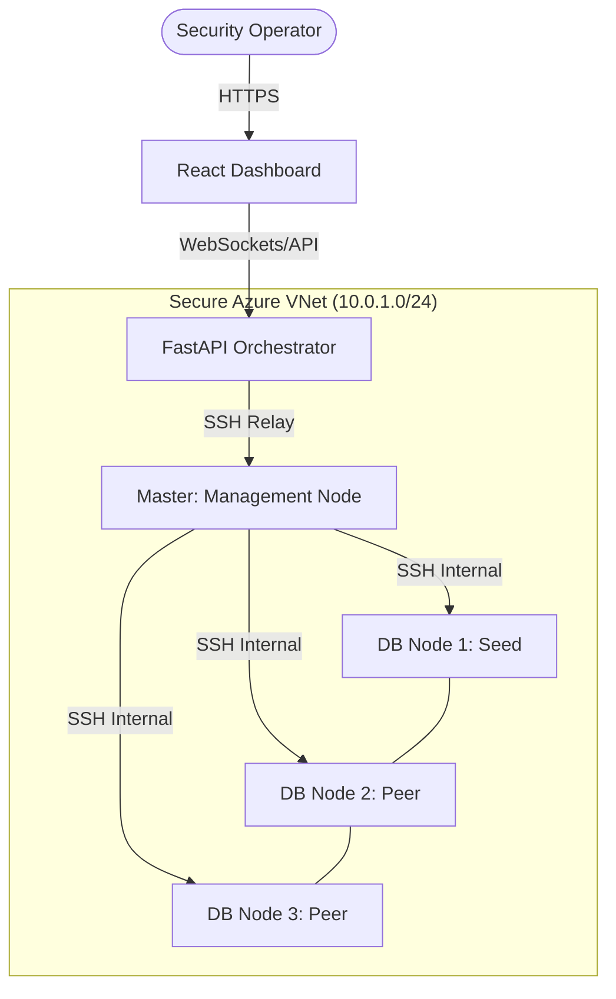

# CIS Apache Cassandra 4.0 — DevSecOps Compliance Platform

[](https://www.cisecurity.org/benchmark/apache_cassandra)
[](#-devsecops-pipeline)
[](LICENSE)

> **NT542.Q22 DevSecOps — Final Project**  
> An end-to-end automated platform for auditing and hardening a 3-node Apache Cassandra cluster according to the **CIS Apache Cassandra 4.0 Benchmark**.

---

## 📋 Project Overview

This repository provides a production-ready **DevSecOps framework** designed to transform manual security compliance into an automated, verifiable pipeline. Instead of static documentation, we provide "Compliance-as-Code" to ensure your Cassandra infrastructure is secure by default and resilient against configuration drift.

### Core Objectives
- **Automated Auditing**: One-click assessment of the entire cluster against CIS v1.3.0 standards.
- **Automated Remediation**: Scripted hardening logic to move nodes from vulnerable to compliant status in seconds.
- **Continuous Enforcement**: A CI/CD pipeline that blocks insecure code or configuration changes from entering production.
- **Real-time Observability**: A modern dashboard providing live telemetry of the cluster's security posture.

---

## 🏗️ System Architecture

The platform follows a centralized orchestration model. The **Orchestration API** (FastAPI) manages the security state by dispatching tasks to worker nodes via secure SSH tunnels.



### Technical Stack
| Component | Technology | Purpose |
| :--- | :--- | :--- |
| **Infrastructure** | Azure + Terraform | IaaS with automated provisioning |
| **Database** | Cassandra 4.0.20 | Secure-configured NoSQL cluster |
| **Hardening** | Bash + `cis-tool.sh` | CIS v1.3.0 audit and remediation engine |
| **API Layer** | Python + FastAPI | Task orchestration and ANSI-sanitized reporting |
| **Dashboard** | React + Vite | Real-time security state visualization |

---

## 🛡️ Current Compliance Posture (v1.3.0)

As of the latest automated audit run, the cluster has achieved **Level 1 Compliance** for all primary authentication and OS-level security benchmarks.

| Section | Description | Status | Automation |
| :--- | :--- | :--- | :--- |
| **1. Installation** | User/Group, Versions, NTP | ✅ PASS | 100% |
| **2. Auth/Authz** | Password Auth, Role Authorization | ✅ PASS | 100% |
| **3. Access Control** | Role Demotion, Superuser Protection | ✅ PASS | 80% (Manual Reviews Required) |
| **4. Logging** | Level: INFO, BinAuditLogger | ✅ PASS | 100% |
| **5. Encryption** | Inter-node & Client TLS | ❌ FAIL | Awaiting PKI/Cert Implementation |
| **OS Custom** | Swap, YAML Perms, SSH, TCP/IP | ✅ PASS | 100% |

> [!IMPORTANT]
> **Manual Review Required**: Sections 3.3, 3.7, and 3.8 are flagged as `MANUAL`. Operators must periodically run the provided CQL queries in `cis-tool.sh` to review role privileges.

---

## 🚀 Getting Started

### 1. Execute Cluster Audit
To perform a full-cluster security assessment from the Master node:
```bash
sudo bash scripts/cis-tool.sh cluster audit
```
*Results are exported to `scripts/reports/report.json` and `report.csv`.*

### 2. Apply Automated Hardening
To remediate all detected Level 1 vulnerabilities:
```bash
sudo bash scripts/cis-tool.sh cluster harden
```

### 3. Launch Dashboard & Backend
```bash
# Start Backend (Master Node)
cd backend && sudo bash ../scripts/run_backend.sh

# Start Frontend (Master Node)
cd frontend && sudo bash ../scripts/run_frontend.sh
```

---

## 🔗 DevSecOps Pipeline

The repository integrates a strict **Security Gate** via GitHub Actions:
- **Static Analysis (SAST)**: Bandit scans backend Python code for vulnerabilities.
- **CVE Scanning**: Trivy audits the filesystem and dependencies for known exploits.
- **Compliance Gating**: CI fails if the `audit-fixture.json` detects any **CRITICAL** violations.
- **Automated Sync**: Verified scripts are automatically synchronized to Azure nodes upon merging to `main`.

---

## 🔮 Future Roadmap (Handoff)

For future AI agents or developers continuing this project:
1. **Implement PKI**: Transition Section 5 (Encryption) from `FAIL` to `PASS` by implementing a Certificate Authority (CA) and automated certificate rotation.
2. **Dynamic Gating**: Transition Job 6 of the CI/CD pipeline from a static fixture to a live containerized audit run.
3. **IAM Integration**: Connect the Cassandra RBAC system to an external identity provider (e.g., Azure AD via LDAP).

---

## 👥 Team
- **Project Lead**: [User Name]
- **Members**: Infrastructure, Security, Backend, and Frontend Specialists.

---

## 📚 References
- [CIS Apache Cassandra 4.0 Benchmark v1.3.0](https://www.cisecurity.org/benchmark/apache_cassandra)
- [NIST SP 800-53 (AC/AU Controls)](https://csrc.nist.gov/publications/detail/sp/800-53/rev-5/final)
