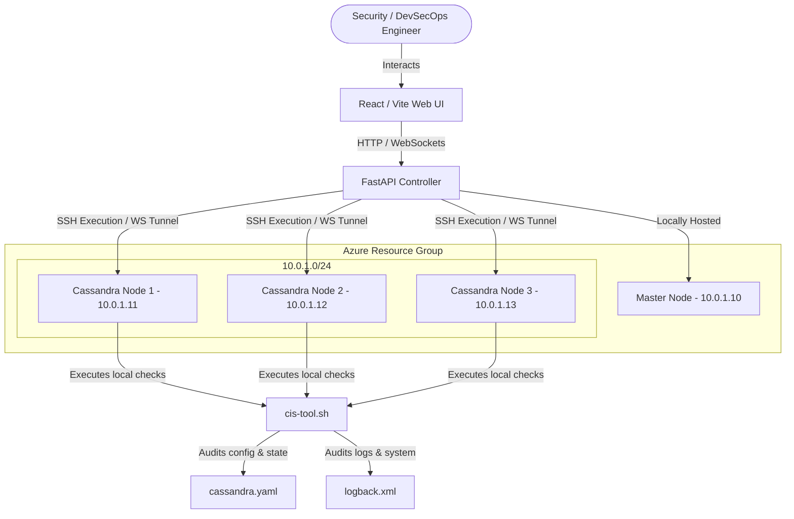

# CIS Apache Cassandra 4.0 Compliance Automator & Dashboard

A comprehensive DevSecOps orchestration suite designed to audit, remediate, and monitor Apache Cassandra 4.0 clusters against the **CIS Apache Cassandra 4.0 Benchmark v1.3.0**. 

The system provides a real-time React web dashboard, a FastAPI orchestration controller, a lightweight local/remote Bash agent, and Terraform Infrastructure-as-Code (IaC) configurations for deploying a secure 3-node Cassandra cluster on Azure.

---

## 🏗️ Architecture Overview

The platform uses a centralized orchestration pattern combined with lightweight distributed agents.



1. **Web Dashboard (Frontend)**: Real-time UI showing overall security scores, detail check statuses (PASS/FAIL/MANUAL), live WebSocket audit streams, and a collaborative DevSecOps notes panel.
2. **Orchestrator API (Backend)**: Connects to the Cassandra nodes via SSH to run scans and apply automatic hardening rules, returning streaming stdout via WebSockets.
3. **Compliance Agent (`cis-tool.sh`)**: Lightweight local script running on target DB nodes. It performs direct inspections of configs (`cassandra.yaml`, `logback.xml`), environmental variables, system files, and Cassandra DB tables (via `cqlsh`).
4. **Cloud Infrastructure (Terraform)**: Deploys the VNet, Subnet, Network Security Groups (NSGs), Azure Key Vault, and VM instances.

---

## 📁 Repository Structure

```
├── backend/                  # FastAPI Application
│   ├── routers/              # API endpoints (nodes, audit, metrics, reports, notes)
│   ├── services/             # Core logic (SSH coordination, DB state)
│   ├── ws_endpoints/         # WebSocket handlers for real-time log streaming
│   ├── requirements.txt      # Python backend dependencies
│   └── .env.example          # Environment template for backend settings
│
├── frontend/                 # React TypeScript Frontend
│   ├── src/
│   │   ├── pages/            # Dashboard, Compliance, Audit Live, Notes, Monitoring
│   │   ├── components/       # Visual widgets and tables
│   │   └── api.ts            # API connector functions
│   ├── tailwind.config.js    # Custom Tailwind styling configuration
│   └── package.json          # Frontend packages & dependencies
│
├── terraform/                # Infrastructure-as-Code for Azure
│   ├── main.tf               # Provider, VNet, Subnet resource descriptions
│   ├── vms.tf                # VM cluster and Cloud-init setup configurations
│   ├── nsg.tf                # Port security rules (SSH, Cassandra gossip/cql)
│   ├── keyvault.tf           # Azure Key Vault settings for credentials
│   └── variables.tf          # Configurable variables for Azure deployment
│
├── scripts/                  # Shell utilities & Benchmark assets
│   ├── sections/             # Modular check scripts (1_install, 2_auth, 3_access, 4_audit, 5_encryption)
│   ├── cis-tool.sh           # Node-level compliance checking script
│   ├── export_excel.py       # Exporter to generate Excel compliance reports
│   └── run_backend/frontend  # System service execution scripts
│
└── demo/                     # Test cases and pipeline execution scripts
    ├── 1_Live_Fix_Flows/     # Step-by-step security misconfiguration demo scenarios
    └── 2_Cluster_Audit_Report/ # Full cluster orchestrator demo scripts
```

---

## ⚡ Quick Start & Deployment

### 1. Provision Infrastructure (Terraform)
Navigate to the `terraform` folder to build the 1-Master, 3-DB node Azure environment.

```bash
cd terraform
# Initialize and apply plan
terraform init
terraform apply -var-file="secrets.tfvars"
```
*Note: Make sure your `secrets.tfvars` specifies `ssh_public_key_path` and `allowed_ssh_ips` (to restrict SSH entry to your public IP).*

### 2. Configure Backend
Copy `.env.example` in `backend/` to `.env` and fill in the outputs obtained from Terraform:

```bash
cd ../backend
cp .env.example .env
# Edit .env variables
# NODE_IPS=10.0.1.11,10.0.1.12,10.0.1.13
# CIS_SSH_KEY=/path/to/your/private_key
# CIS_SSH_USER=cassandra
```

Install dependencies and start the FastAPI web server:
```bash
pip install -r requirements.txt
python main.py
```

### 3. Configure Frontend
Copy `.env.example` in `frontend/` to `.env` and target the Backend public IP address:

```bash
cd ../frontend
cp .env.example .env
# VITE_API_URL=http://<MASTER_VM_PUBLIC_IP>:8000
```

Install packages and run the Vite dev environment:
```bash
npm install
npm run dev
```

---

## 🛠️ Usage: Compliance Tool CLI

The core tool `cis-tool.sh` is located in the root directory and inside the `/scripts` directory. You can run checks and hardening scripts directly on nodes or orchestrate the cluster from the Master controller.

### Local Node Commands
Must be executed as `root` (or with `sudo`) on target Cassandra nodes.

```bash
# Run a complete CIS benchmark audit scan
sudo ./cis-tool.sh audit

# Audit a specific CIS Section (e.g. Authentication/Authorization checks)
sudo ./cis-tool.sh audit --section 2_auth

# Run automated hardening/remediation for all sections
sudo ./cis-tool.sh harden

# Verify current compliance state
sudo ./cis-tool.sh verify
```

### Cluster Orchestration Commands
Executed from the Master node (requires configured SSH settings to the database nodes).

```bash
# Run audits on all Cassandra cluster nodes
./cis-tool.sh cluster audit

# Run automated hardening on all Cassandra cluster nodes
./cis-tool.sh cluster harden

# Verify states on all cluster nodes (rolling update execution)
./cis-tool.sh cluster verify
```

---

## 🔬 Demo Scenarios & Validation

The `/demo` directory contains predefined shell scripts that simulate security misconfigurations, audit findings, automated fixes, and verification reporting.

### Demo 1: Authentication Hardening (Rec 2.1)
Simulates setting the weak `AllowAllAuthenticator` configuration and fixes it to `PasswordAuthenticator`.
```bash
bash demo/1_Live_Fix_Flows/demo_flow_1_auth.sh
```

### Demo 2: Authorization Hardening (Rec 2.2)
Simulates setting the weak `AllowAllAuthorizer` and hardening it to `CassandraAuthorizer`.
```bash
bash demo/1_Live_Fix_Flows/demo_flow_2_authorizer.sh
```

### Demo 3: Audit Logging Hardening (Rec 4.2)
Disables audit logging on Cassandra nodes and tests the automated remediation turning it back to `enabled: true`.
```bash
bash demo/1_Live_Fix_Flows/demo_flow_3_audit.sh
```

### Demo 4: Full Multi-Node Cluster Flow
Simulates distinct security misconfigurations on Node 1, Node 2, and Node 3 concurrently, audits the cluster to show individual failures, executes a centralized cluster-wide hardening run, and produces a consolidated multi-sheet report.
```bash
bash demo/2_Cluster_Audit_Report/demo_full_cluster_flow.sh
bash demo/2_Cluster_Audit_Report/demo_3_verify.sh
```

### Report Generation
Use the python reporter to export database results into a structured Excel file (`CIS_Cassandra_Compliance_Report.xlsx`):
```bash
python scripts/export_excel.py
```
