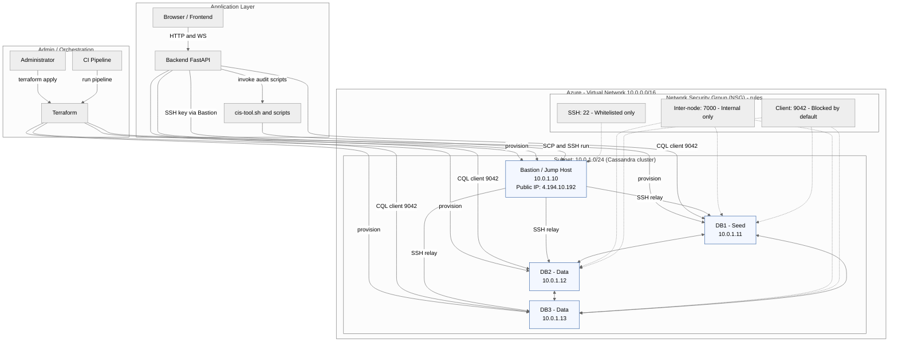

# Flows — Infrastructure & Network Diagram (single canonical file)

This single file contains both the infrastructure layout (Azure VNet/Subnet/NSG) and the application/data/control flows for the project. It replaces previous diagram variants and is the canonical diagram to render.



Notes:

- This canonical diagram models both the physical Azure network and the application flows. Key points:
  - Terraform provisions Bastion and DB nodes directly; there is no abstract `VMs` node.
  - Bastion is a jump host (not a Cassandra master). Avoid calling it "master" to prevent confusion.
  - Cassandra nodes form a ring (bidirectional gossip) and listen on inter-node port 7000 (internal only).
  - Client port 9042 should be blocked by default at NSG unless explicitly allowed.

Rendering:

Use Mermaid CLI to render this file's mermaid block. From repo root:

```bash
npx @mermaid-js/mermaid-cli -i diagrams/flows-infra.md -o diagrams/flows-infra.png
```

If you prefer I can also export PNG/SVG here (I'll run mermaid-cli in the environment).
