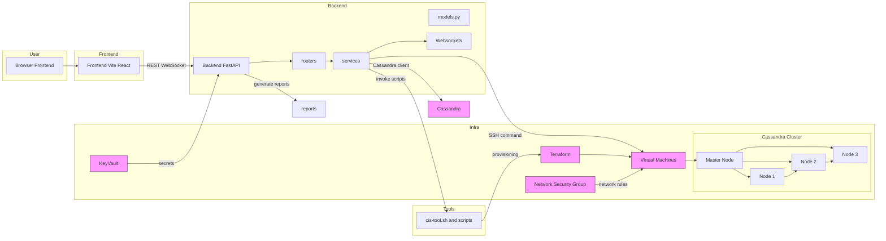

# Flows — Infrastructure & Application Interaction

This diagram shows a basic model linking the Frontend, Backend, Tools, and Infra in this project.

Notes:

- Frontend communicates with the Backend via REST and WebSocket (see `websockets/` and `frontend/src`).
- Backend routes live in `backend/routers` and call concrete logic in `backend/services` which interact with infra (SSH, Cassandra driver).
- Tools/scripts live in `scripts/` and `demo/bin`; they can be invoked by the backend or run manually for remediation or provisioning.
- Terraform definitions are in `/terraform` and provision the VMs, KeyVault, and network resources used by the backend and Cassandra nodes.

Next: add a short README and export diagram to PNG if you want a visual asset.
