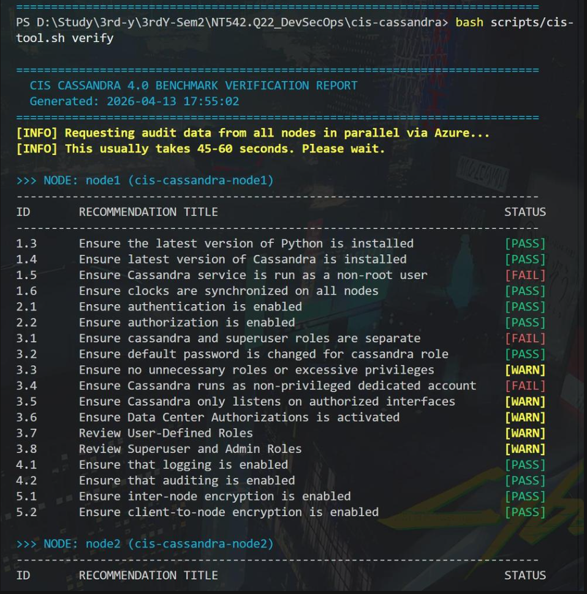
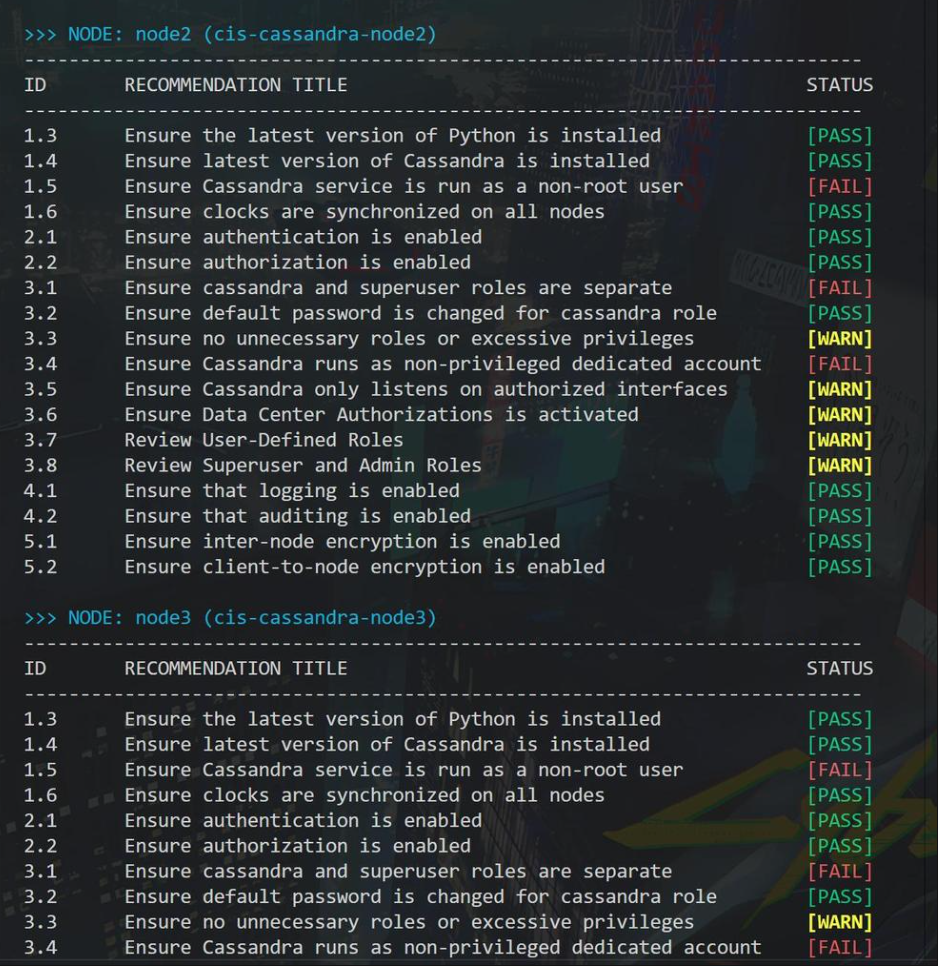
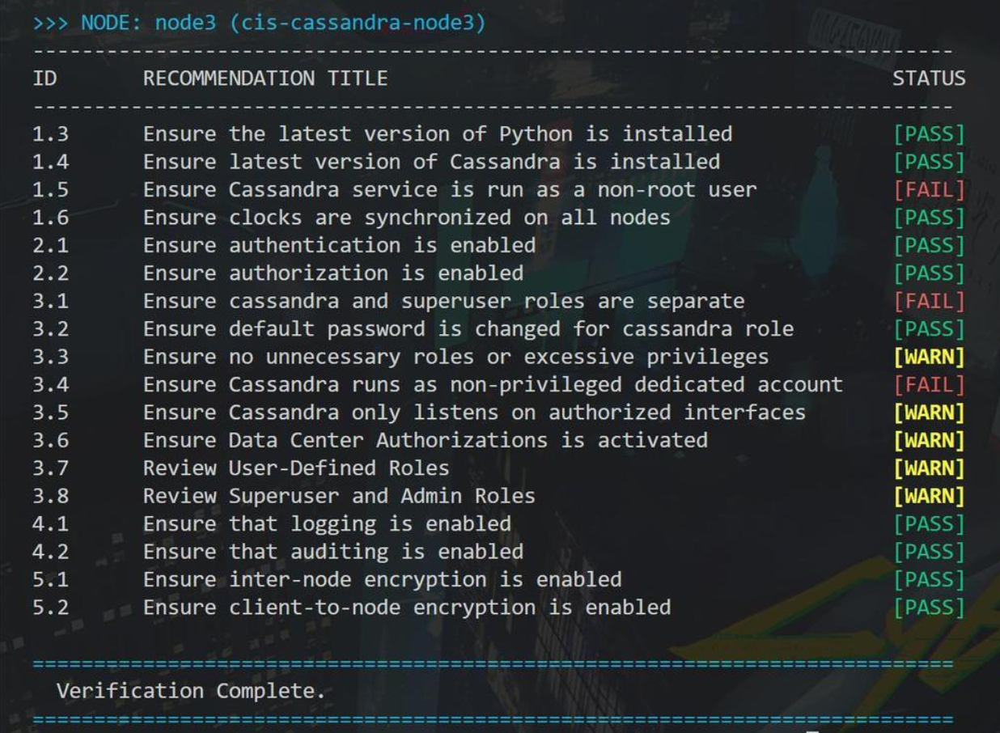
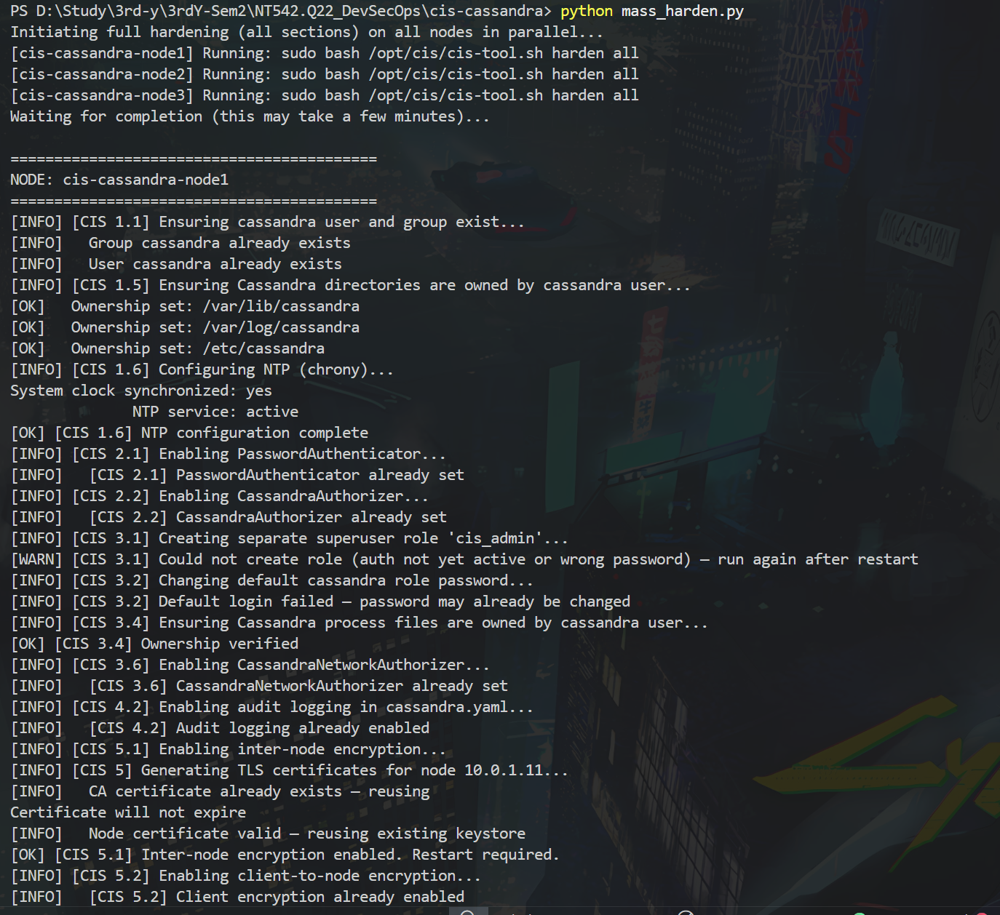
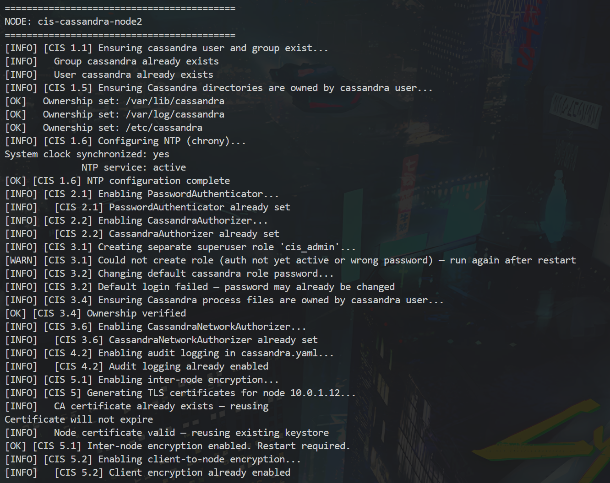
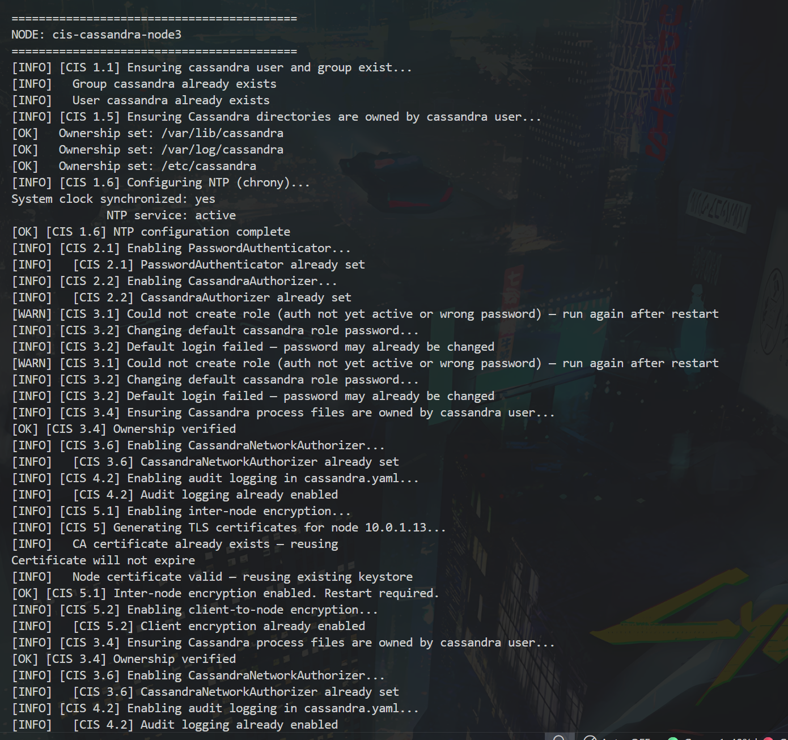

# Báo Cáo Tiến Độ Dự Án CIS Cassandra

Ngày báo cáo: 2026-04-14

## 1. Tóm tắt Tổng thể (Executive Summary)

**Trạng thái hiện tại:** Hệ thống DevSecOps cho Apache Cassandra đã đạt trạng thái sẵn sàng cho việc Demo cuối kỳ. 

- **Cốt lõi:** Đã hoàn thiện framework `cis-tool.sh` hỗ trợ cả Audit (phát hiện) và Harden (khắc phục) theo chuẩn CIS v1.3.0.
- **Tự động hóa:** Các script `deploy_node1.py` và `mass_harden.py` cho phép quản trị và hardening đồng loạt cụm 3 node từ xa một cách ổn định.
- **Quan trắc:** Ngăn xếp Prometheus/Grafana đã tích hợp sâu, cho phép theo dõi compliance và hiệu năng database theo thời gian thực.
- **Tối ưu hóa:** Toàn bộ codebase đã được chuẩn hóa và tinh gọn, sẵn sàng cho việc bàn giao và triển khai thực tế.

Dự án hiện đã đầy đủ khung nền tảng để thực hiện quy trình bảo mật khép kín: **Audit -> Harden -> Re-audit -> Monitoring**.

---

## 2. Mục tiêu Hiện tại

Mục tiêu của nhóm là hoàn thiện một nền tảng DevSecOps cho Apache Cassandra 4.0 theo CIS Benchmark v1.3.0, gồm 3 phần chính:

1. **Audit tự động** các node Cassandra.
2. **Hardening và remediation** cho những cấu hình bảo mật có thể tự động hóa.
3. **Hiển thị trạng thái compliance** và giám sát hệ thống (monitoring) theo thời gian thực.

---

## 3. Kiến trúc & Công nghệ (Architecture & Tech Stack)

### 3.1 Tech Stack
- **Hạ tầng:** Azure, Terraform, Ubuntu 22.04 LTS ARM64, 3 VM trong cùng VNet.
- **Database:** Apache Cassandra 4.0.
- **Security scripts:** Bash, cis-tool.sh, deploy_node1.py, mass_harden.py, SSH key-based access.
- **Backend:** Python 3.12, FastAPI, Pydantic, Paramiko, pytest.
- **Frontend:** React 18, Vite, TypeScript, Tailwind CSS, Vitest.
- **Monitoring:** Prometheus, Grafana, JMX Exporter.
- **CI/CD:** GitHub Actions, lint/test/security gate.

### 3.2 Topology
*Topology triển khai trên Azure VNet 10.0.1.0/24 (Subnet Cassandra / internal cluster):*

- **VM1 (Seed Node/Điều khiển chính):** 10.0.1.11
- **VM2 (Data Node):** 10.0.1.12
- **VM3 (Data Node):** 10.0.1.13

**Luồng dữ liệu và kết nối chính:**
- Truy cập SSH bị giới hạn theo whitelist IP được phép.
- Cassandra giao tiếp nội bộ qua cổng 7000-7001; CQL client dùng 9042 trong VNet.
- Frontend React gọi Backend FastAPI qua HTTP/HTTPS.
- FastAPI điều phối lệnh lên 3 node qua kết nối SSH để chạy audit/harden.
- Monitoring stack sử dụng Prometheus scrape JMX Exporter; Grafana lấy dữ liệu hiển thị (có nhúng iframe vào frontend hoặc độc lập trên cổng 3001).

---

## 4. Cơ chế Vận hành & Phân quyền Tool (Workflow)

Bộ công cụ CIS Cassandra được thiết kế để tự động hóa tối đa quy trình đánh giá và bảo mật, hoạt động dựa trên sự phân tách minh bạch giữa các thao tác script và đánh giá của quản trị viên (Admin):

- **Chế độ Audit (Kiểm tra tuân thủ):**
  - Thực thi bằng lệnh `cis-tool.sh audit all` hoặc giao diện Web (gọi qua FastAPI).
  - Phân tích chi tiết file cấu hình, quyền user, và cấp process OS.
  - Kết quả xuất chuẩn JSON phân loại: `PASS` (Đạt), `FAIL` (Lỗi), và `NEEDS_REVIEW` (Cần con người đánh giá).
- **Chế độ Harden (Tự động khắc phục - Automated Remediation):**
  - Thực thi bằng `cis-tool.sh harden all` (tại node) hoặc `mass_harden.py` (điều phối cụm Azure Remote Command).
  - Tự động hóa: sửa `cassandra.yaml`, đổi quyền `chown`, thiết lập mã hóa TLS và cấu hình xác thực (PasswordAuthenticator).
  - Xuất console log theo thời gian thực (Live implement logs) để giám sát.
- **Quy trình Xác minh (Verify):**
  - Lệnh `cis-tool.sh verify` tổng hợp kết quả của toàn cụm thành định dạng text trực quan (bảng biểu CLI), phục vụ mục đích chụp ảnh màn hình lưu bằng chứng nhanh chóng.
- **Tác vụ Thủ công (Manual Implementation):**
  - Dành cho các khuyến nghị rủi ro cao hoặc phụ thuộc hệ thống (giờ NTP, rà soát user đặc thù). Tool chỉ cung cấp *bằng chứng/logs (evidence)* qua trạng thái `NEEDS_REVIEW`, buộc quản trị viên ra quyết định thay vì tự động thay đổi bừa bãi.

---

## 5. Các Hạng mục Đã Hoàn Thành

- Triển khai thành công bộ script CIS audit/harden trong thư mục `scripts/`.
- Hoàn thiện Backend FastAPI: điều phối cluster status, audit, harden và streaming dữ liệu qua SSE.
- Hoàn thiện Frontend Dashboard: giao diện trực quan cho compliance, nhật ký audit, và nhúng monitoring.
- Cài đặt thành công ngăn xếp giám sát Prometheus/Grafana (`monitoring/`).
- Viết Unit Test cho cả API và UI.
- Tối ưu hóa và chuẩn hóa Codebase: dọn dẹp các tệp bộ nhớ đệm, tệp thừa, căn chỉnh chuẩn bị cho production.
- **Thành công chạy kiểm thử tuân thủ thực tế trên cụm 3 node:** Các node đã qua bài test cốt lõi: Encryption (Sec 5), Logging (Sec 4) và Auth (Sec 2).
- Cấu hình file `.gitignore` cẩn thận để loại bỏ các tệp nhạy cảm/nội bộ (review.md).

---

## 6. Trạng thái Tuân thủ Hiện tại & Bằng chứng (Baseline)

Dựa trên kết quả `cis-tool.sh verify` mới nhất được chạy đồng bộ trên 3 node, dưới đây là tình hình bảo mật cụm Cassandra:

| Nhóm Check | Trạng thái Baseline | Tổn đọng cần khắc phục |
| :--- | :--- | :--- |
| **Section 1: Installation** | Tương đối tốt | Cần fix 1.5 (ngăn chặn Cassandra chạy quyền root). |
| **Section 2: Auth/Authz** | **[PASS] Toàn cụm** | 2.1 & 2.2 đã được bảo mật. |
| **Section 3: Access Control** | Trọng tâm tối ưu | Cần cấu hình phân tách Superuser (3.1) & sửa tài khoản chạy dịch vụ (3.4). |
| **Section 4: Logging/Audit** | **[PASS] Toàn cụm** | Cơ chế logging (4.1, 4.2) hoạt động chuẩn yêu cầu. |
| **Section 5: Encryption** | **[PASS] Toàn cụm** | TLS nội bộ (5.1) và TLS cho client (5.2) đã kích hoạt thành công. |

### 6.1 Bằng chứng Tuân thủ (Verify Logs)

Kết quả lệnh `cis-tool.sh verify` thể hiện rõ trạng thái tuân thủ của từng hạng mục trên cả 3 Node:

**Node 1 (cis-cassandra-node1):**

> *Phân tích: Audit Engine đánh giá chuẩn xác lỗi [FAIL] ở rủi ro hạ tầng (1.5, 3.4), trong khi cấu hình mã hóa/xác thực đạt [PASS].*

**Node 2 (cis-cassandra-node2):**

> *Phân tích: Tương tự Node 1, các chuẩn phân quyền hệ thống (OS Level) đang được phát hiện tốt và đánh dấu rủi ro cao buộc quản trị viên can thiệp chặn quyền Root.*

**Node 3 (cis-cassandra-node3):**

> *Phân tích: Kết quả đồng nhất trên node cuối, minh chứng tool nhận diện nhất quán trạng thái bảo mật trên toàn bộ cluster.*

---

### 6.2 Bằng chứng Tự động khắc phục (Harden / Implement Logs)

Dưới đây là hình ảnh thực thi khi hệ thống `mass_harden.py` giao tiếp qua Azure Run-Command để thiết lập bảo mật tự động trên 3 Node.

**Node 1 (cis-cassandra-node1):**

> *Phân tích: Script xử lý mượt mà tác vụ gán quyền thư mục (`/var/lib/cassandra`), và thông minh dò tìm, **tái sử dụng** CA certificate ở Section 5 thay vì khởi tạo lại gây lỗi.*

**Node 2 (cis-cassandra-node2):**

> *Phân tích: Thể hiện khả năng bắt lỗi êm ái (Graceful Failure). Ở bước tạo Role (3.1), script in cảnh báo `[WARN]` và lùi bước vì Auth cần restart chứ không bị crash ứng dụng.*

**Node 3 (cis-cassandra-node3):**

> *Phân tích: Giao tiếp song song thành công trên Node 3, khẳng định khả năng scale tự động hóa khắc phục (remediation) lớn của script qua môi trường Azure.*

---

## 7. Kế hoạch Tiếp theo (Next Steps)

1. Xử lý triệt để các fail Critical ở Section 1 và 3 thông qua remediation scripts hoặc tài liệu manual.
2. Hoàn thiện Flow UI: Rút gọn luồng *Re-audit ngay sau khi remediation* trên dashboard.
3. Chạy kịch bản Demo End-to-End: Audit -> Xử lý (Harden) -> Verify lại -> Mở Monitoring theo dõi.
4. Tổng hợp, đóng gói tài liệu hệ thống thành Slide/Sheet tóm tắt để ban giám khảo/giảng viên có thể đọc hiểu trong 1-2 phút.
